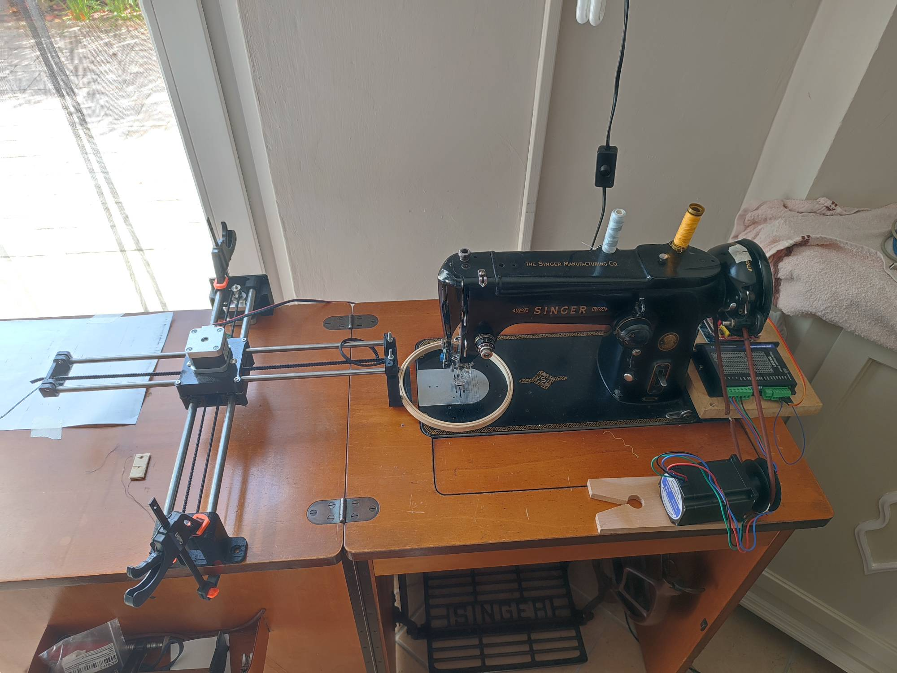
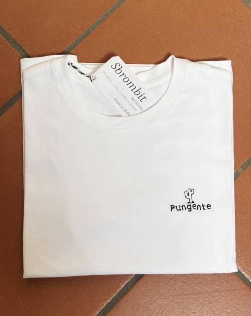

# Singer Embroidery Machine
Arduino Based Embroidery Machine

## How it works
We will upload grbl to our arduino and using Inkscape and InkStich plugin we are going to generate our image and convert it to a gcode file.
The gcode is sent to our embroidery machine using UGS (Universal G-Code Sender).
Before starting the embroidery part, we have to confiugre and calibrate the machine, so that if I move the x and y axis by 1cm a 1cm movement is actually made and that the z axis in our case will be the needle, makes a complete revolution so that the plate is only moved once the needle has returned to its highest position.

## Result

## Components
- Arduino UNO + CNC Shield
- 2x Nema 17 + 2x DRV8825 driver
- 1x Nema 23 + DM556T driver

